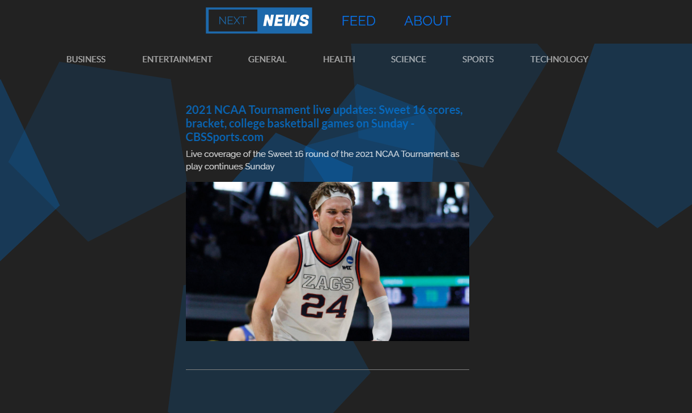

## Table of Contents

* [Description](#description)
* [Links](#links)
* [Screenshots](#screenshots)
* [Installation](#installation)
* [Usage](#usage)
* [Technologies Used](#technologies)
* [Questions](#questions)

## Description

Next news is a simple way to view the latest news articles. It uses the Api libraray from NewsApi.Org. View based on catagroy. Using React/Next.js for Serverside Rendering for SEO. Has mobile responsive UI with scroll and text animations with a Particle.js background. 

## Links

[See the Deployed Application](https://nextnews-ebon.vercel.app/)

## Screenshots

## Installation Instructions

run "npm run dev" in the command line

## Usage

Please explore my professional information
 

## Technologies Used

HTML, CSS, JS, React, Next.js, BootStrap, typewriter-effect, react-text-loop, patricle.js, Vercel

## Questions

If you have further projects and questions, you can find me on Github: [GITHUB](https://github.com/benimahat1291). 
please visit my portfolio to find contact information: [BENI MAHAT](https://benimahat1291.github.io/Portfolio_v2/#/). 